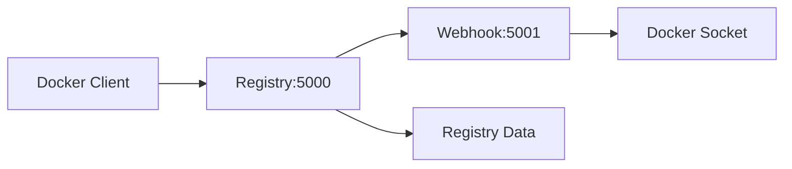

# Hooky Registry

[](https://github.com/hnrobert/hooky-registry/actions/workflows/build.yml)

A private Docker registry solution with integrated webhook auto-deployment functionality. When new images are pushed to the registry, it automatically pulls the latest images and restarts related containers.

## Features

- 🐳 **Private Docker Registry**: Based on official Docker Registry 2.0
- 🔄 **Auto Deployment**: Automatically trigger container restarts when images are pushed
- 📡 **Webhook Support**: Listen to image push events via webhooks
- 🔧 **Flexible Configuration**: Support for custom configuration and environment variables
- 🚀 **Ready to Use**: One-click startup with docker-compose

## System Architecture



## Quick Start

### Prerequisites

- Docker Engine 20.10+
- Docker Compose v2.0+
- External network and volumes created (see setup below)

### 1. Create External Resources

```bash
# Create external network
docker network create mach-network

# Create external volume
docker volume create registry-data
```

### 2. Clone Project

```bash
git clone <repository-url>
cd hooky-registry
```

### 3. Start Services

```bash
# Start all services
docker-compose up -d

# Check service status
docker-compose ps

# View logs
docker-compose logs -f
```

### 4. Verify Services

```bash
# Check Registry service
curl http://localhost:5000/v2/_catalog

# Check Webhook service
curl http://localhost:5001/health
```

## Usage

### Push Images to Private Registry

```bash
# 1. Build image
docker build -t my-app:latest .

# 2. Tag image
docker tag my-app:latest localhost:5000/my-app:latest

# 3. Push image (automatically triggers webhook)
docker push localhost:5000/my-app:latest
```

### Run Containers (Will be Auto-restarted)

```bash
# Run container using private registry image
docker run -d --name my-app-container localhost:5000/my-app:latest
```

When you push a new version of `my-app:latest` image, the webhook will automatically:

1. Pull the latest image
2. Handle containers according to the configured update strategy

## Container Update Strategies

The system supports two container update strategies, controlled by the `UPDATE_STRATEGY` environment variable:

### 🔄 Recreate Strategy (Recommended, Default)

```bash
UPDATE_STRATEGY=recreate
```

**Workflow:**

1. Pull the latest image
2. Get complete configuration of existing containers (port mappings, environment variables, volumes, networks, etc.)
3. Stop and remove old containers
4. Recreate containers with new image and same configuration
5. Reconnect to original networks

**Pros:**

- ✅ Ensures use of latest image
- ✅ Complete container reinitialization
- ✅ Cleans up old container state

**Cons:**

- ❌ Brief service interruption
- ❌ Container ID will change

### 🔁 Restart Strategy

```bash
UPDATE_STRATEGY=restart
```

**Workflow:**

1. Pull the latest image
2. Simply restart existing containers

**Pros:**

- ✅ Fast restart
- ✅ Container ID remains unchanged

**Cons:**

- ❌ May still use old image (Docker caching mechanism)
- ❌ Does not clean internal container state

### Strategy Selection Guidelines

| Scenario          | Recommended Strategy | Reason                                  |
| ----------------- | -------------------- | --------------------------------------- |
| Production        | `recreate`           | Ensure latest image, avoid cache issues |
| Development       | `recreate`           | Get latest features and fixes           |
| Quick Testing     | `restart`            | Reduce restart time                     |
| Stateful Services | `recreate` + volumes | Data persistence + code updates         |

## Configuration

### Environment Variables

| Variable Name     | Default Value    | Description                                        |
| ----------------- | ---------------- | -------------------------------------------------- |
| `REGISTRY`        | `127.0.0.1:5000` | Registry service address                           |
| `WEBHOOK_PORT`    | `5001`           | Webhook service port                               |
| `UPDATE_STRATEGY` | `recreate`       | Container update strategy: `recreate` or `restart` |

### Configuration Files

#### config.yml

Main configuration file for Registry, including:

- HTTP service configuration
- Storage backend configuration
- Webhook notification configuration

#### docker-compose.yaml

Service orchestration configuration, defining:

- Registry service (port 5000)
- Webhook service (port 5001)
- Network and volume configuration

## File Structure

```text
hooky-registry/
├── .github/workflows/      # GitHub Actions CI/CD
│   └── build.yml          # Docker image build and push
├── docker-compose.yaml     # Docker Compose configuration
├── Dockerfile             # Webhook service image build
├── config.yml            # Registry configuration file
├── webhook_receiver.py   # Webhook service main program
├── requirements.txt      # Python dependencies
└── README.md            # Project documentation
```

## Development & Debugging

### CI/CD Pipeline

The project includes automated CI/CD pipeline with GitHub Actions:

- **Build Pipeline** (`build.yml`):

  - Triggers on push to `main` branch or PR
  - Builds multi-platform Docker images (amd64, arm64)
  - Pushes to GitHub Container Registry
  - Creates production docker-compose file
  - Runs security scans with Trivy

### Pre-built Images

Latest images are automatically built and available at [ghcr.io](ghcr.io/hnrobert/hooky-registry/webhook-receiver:latest)

### Local Development

```bash
# Install Python dependencies
pip install -r requirements.txt

# Set environment variables
export REGISTRY=127.0.0.1:5000
export WEBHOOK_PORT=5001

# Run webhook service
python webhook_receiver.py
```

### View Logs

```bash
# View all service logs
docker-compose logs -f

# View specific service logs
docker-compose logs -f registry
docker-compose logs -f registry-webhook
```

### Rebuild Services

```bash
# Rebuild and start
docker-compose up -d --build

# Force rebuild
docker-compose build --no-cache
docker-compose up -d
```

## Troubleshooting

### Common Issues

1. **Services won't start**

   - Check if external network exists: `docker network ls | grep mach-network`
   - Check if external volume exists: `docker volume ls | grep registry-data`

2. **Webhook not working**

   - Check if Docker socket is properly mounted
   - View webhook service logs: `docker-compose logs registry-webhook`

3. **Image push fails**

   - Confirm Registry service is running: `curl http://localhost:5000/v2/_catalog`
   - Check network connectivity and firewall settings

4. **Containers not auto-restarting**
   - Ensure container image name exactly matches pushed image name
   - Check webhook logs to see if push events are received

### Debug Mode

Modify log level in `webhook_receiver.py`:

```python
logging.basicConfig(
    level=logging.DEBUG,  # Change to DEBUG
    format='[%(asctime)s] %(levelname)s %(message)s',
)
```

## Security Considerations

- Configure HTTPS and authentication for production environments
- Restrict Docker socket access permissions
- Regularly backup registry data
- Monitor service status and resource usage

## License

[Add your license information]

## Contributing

Issues and Pull Requests are welcome!

---

**Note**: This is a basic version of an auto-deployment solution. For production use, please perform security hardening and feature extensions according to actual requirements.
